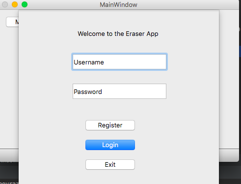
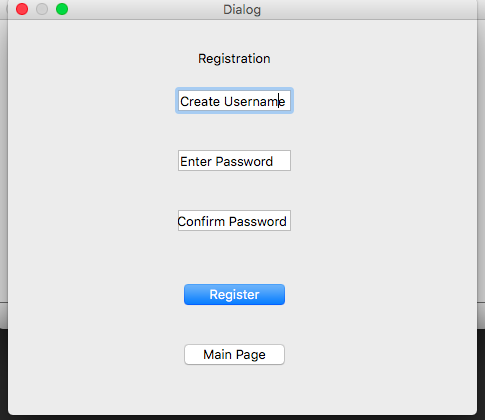
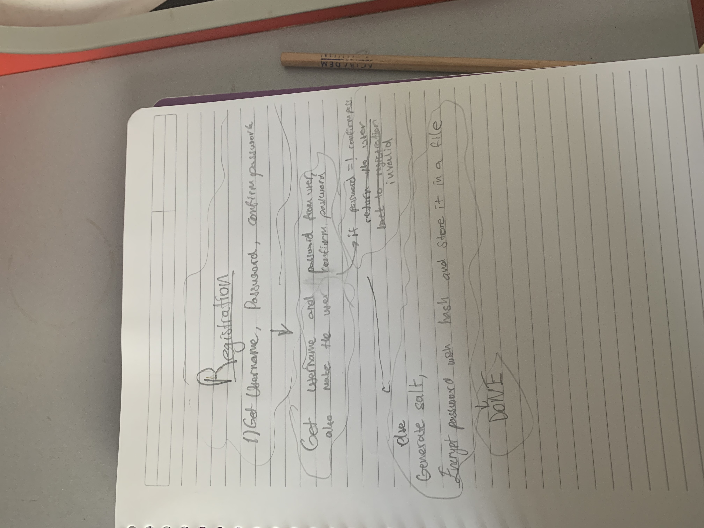
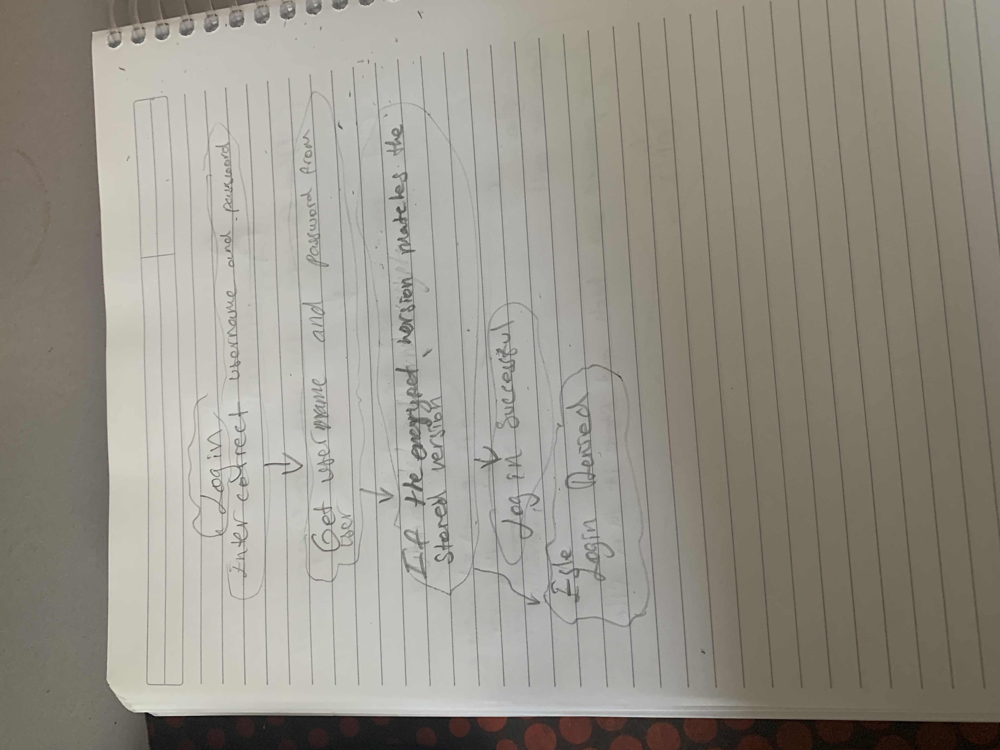
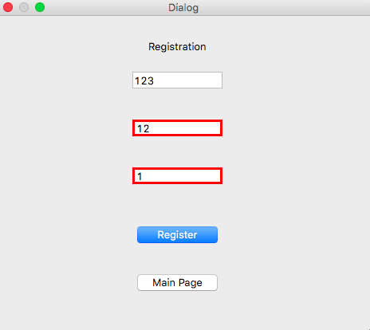
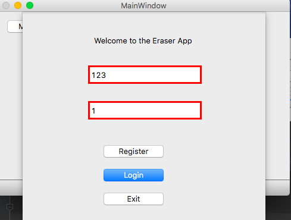
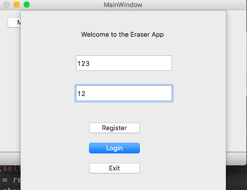
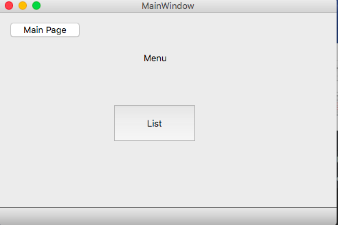

Criteria C: Developement
==
## Creating a mainApp file:
### a) Starting Imports: 
In order to collect all of my windows into one application, I created a mainApp.py folder. After changing all of the dialog windows into QDialog by importing QDialog and changing from object to QDialog`

from PyQt5.QtWidgets import QDialog 
class Ui_Dialog(QDialog):`

I began with also importing the necessary imports from PyQt5 to the main App. These are: 

`from PyQt5 import QtCore, QtGui, QtWidgets
from PyQt5.QtWidgets import QDialog, QMainWindow, QApplication, QTableWidgetItem
import sys`

As you can see I also imported sys which is the system. After that, to collect all of the different py files to the main app I imported them to the main app and changed their names so that it is easier to work on.

`from untitled2 import Ui_MainWindow as mainW
from login import Ui_Dialog as loginD
from register import Ui_Dialog as regD
from Draftsketch1 import Ui_list as listD`

I added addtional imports but I will get to them when I work on it. 

### b) Creating classes:
I found that the easiest way to work on the different windows of the program in the same file will be through creating classes. I started by creating my mainWindow app by 

`class mainWindowApp(QMainWindow, mainW):
    def __init__(self, parent=None):
        super(mainWindowApp, self).__init__(parent)
        self.setupUi(self)`
        
I modified all of the classes to be their parent so any work I do on a class only affects that window. I did these for the other windows as well. for instance the login window:

`class logInApp(loginD):
    def __init__(self, parent=None):
        super(logInApp, self).__init__(parent)
        self.setupUi(self)`
### c) Final touches before I started the functioning process:

I wanted my login app to appear as the first window so first, I chaned my login app to a stable window so it is attached in front of the mainwindow (from QTDesigner). To make the login app appear first, in the MainWindow class I put 

`logVar = logInApp(self)
 logVar.show()`
 Right under the `self.setupUi` so that the mainwindow app is inaccesable with the login, which looks like this:
 
 

Finally, since the program is abitrary (personal whim) amount of objects, I had to define QApplications as a container and the main as myMain window. Here is how I did it:

`container = QApplication(sys.argv)
main = mainWindowApp()
main.show()
container.exec_()`

Now that everything is done on the set-up part, I continued on with the functioning buttons

## Functioning Buttons:
### a) Functioning betton for directing to other windows.
My first function was for the first appeared window: LogIn. I started by defining the register button (not the process but the direction to the register window) and the exit button. First thing I did was indicating which definition the button will look at when the button is pressed.
`self.register_2.clicked.connect(self.regApp)` So now when the register button is clicked (labeled as register_2) it will direct to the regApp. I continued on with defining the regApp. I would follow a similar process as how I make the login app appear.

`    def regApp(self):
        regVar = registerApp(self)
        regVar.show()`
 As seen above, I created a variable in the definition and set the variable as registerApp(self) this is the register window. To portray the register window, I used a command to show the window.
 
 
 
Now for exiting, I did the same `self.exit.clicked.connect(self.exitApp)` and later on defined exit as
`    def exitApp(self):
        sys.exit(0)` so it exits from the system successfuly.

I did my last touches on direction so now I can go from window to window by button clicks. Another example (From menu to list):
        
`self.list_button.clicked.connect(self.listapplication)  
 def listapplication(self):
        listvar = listApp(self)
        listvar.show() `

Last two buttons I needed to define were the login and register buttons. I left them to the last because they are not defined like the other button. Furthermore, they need to meet some condition in order to work or leave for the other window. I started with register.

### b) Registering and Login:
In order to start the registering process, I decided to think about how I wanted to do it. There were couple ideas in mind but the most logical one was by using the hash method. 

As seen from the flow diagram before getting inputs from the user I needed to `import hashlib, binascii, os` by importing these now I can generate hash passwords so I found one that is already defined and decided to use it (credits are on the bibliography section):

`def hash_password(password):
    """Hash a password for storing."""
    salt = hashlib.sha256(os.urandom(60)).hexdigest().encode('ascii')
    pwdhash = hashlib.pbkdf2_hmac('sha512', password.encode('utf-8'),
                                  salt, 100000)
    pwdhash = binascii.hexlify(pwdhash)
    return (salt + pwdhash).decode('ascii')`
On the third line we generated salt with 60 random numbers, and on the fourth line we created hash and run it 10000 times. This generates a very secure password that is very hard to break and store it in a output file. 

For logging in we are going to use a similar method

In the login section, we are going to encrypt the entered input with salt and hash and see if it matches the stored data that we recently got from the registration. In order to encrypt again from Moluna Alessandro, we define a verification:

`def verify_password(stored_password, provided_password):
    """Verify a stored password against one provided by user"""
    salt = stored_password[:64]
    stored_password = stored_password[64: -1]
    pwdhash = hashlib.pbkdf2_hmac('sha512',
                                  provided_password.encode('utf-8'),
                                  salt.encode('ascii'),
                                  100000)
    pwdhash = binascii.hexlify(pwdhash).decode('ascii')
    return pwdhash == stored_password`
In the third line, the salt takes the first 64 characters of the hash. We encrypt it with the same method and if the encrpyted version matches the stored version, the program returns True.

**Furthermore on registration** Now that we can sucessfuly generate encrypted passwords, we need to store them. I first start by directing the register button 

`        self.reg_1.clicked.connect(self.try_register)` Now time to define it.

`    def try_register(self):
        if self.validate_registration():
            self.store()
            self.close()`
Here this if command checks if the register is valid or not. If it is valid it will store it and close it.

**There are couple of things we need to define**. First one is the validation of the password before the whole registration. So I created a definition:

`    def password_validation(self):
        password = self.pass_1.text()
        confpass = self.pass_2.text()
        if password != confpass:
            self.pass_1.setStyleSheet("border: 3px solid red")
            self.pass_2.setStyleSheet("border: 3px solid red")
            return False
        else:
            self.pass_1.setStyleSheet("border: 3px solid green")
            self.pass_2.setStyleSheet("border: 3px solid green")
            return True`
I created two variables: password and confpass. These are the password and confirm password inputs respectively. I added an if command so if the password is not the same as confirm password, outline of both of the boxes will turn red and it will return false which makes the user try again. Here is an image when the password does not match confirm password:

Else, when both of the passwords match eachother, we will go to the second step, validating registration.

Now it is time to define the registration, so I created a definition:

`    def validate_registration(self):
        username = self.username_1.text()
        password = self.password_validation()
        print(username, password)
        return username and password`
        
I start by making a username and password variable. The two password variables (this one and the one from the other definition) are not the same because they are under different definitions. So for this time I set the password as the validated password (the True one). I print the username and password so it can be seen in the console. I return the username and password so it can now go to the storing proccess. 

Final step of registration: storing. Again I started by creating a definition.

    `def store(self):
        username = self.username_1.text()
        password = self.pass_1.text()
        print("Hashing", username + password)
        msg = hash_password(username + password)
        with open('Output.txt', "a") as output_file:
            output_file.write('{}\n'.format(msg))
        self.close()`
Again I set two variables username and password and set them as the validated version of the username and password. I start hashing the username and password so it is encyrpted. I get the hashed password, open the Output.txt file and append it and write the hashed password into the output text. I finish it off by closing the store.

The registration is complete, **Now time to finish login**.

Similar to the registration I create a directory `self.confirm.clicked.connect(self.try_login)` and define it.

   ` def try_login(self):
        username = self.username.text()
        password = self.password.text()
        print("Hashing", username + password)
        correct_password = username + password
        with open('Output.txt', "r") as output_file:
            for stored_password in output_file:
                if verify_password(stored_password, correct_password):
                    self.username.setStyleSheet("border: 3px solid green")
                    self.password.setStyleSheet("border: 3px solid green")
                    self.close()

                else:
                    self.username.setStyleSheet("border: 3px solid red")
                    self.password.setStyleSheet("border: 3px solid red")`
`
    One thing that is different between the login and registration is that, I can handle the login section in one definition. I again start by setting two variables. These are Username and Password respectively. After I get the username and password I hash them. I create a third variable "correct password" with is username + password. Moreover, I open the output file and start verification process. In scope of the stored passwords in the Output.txt file, if the "verify_password" so the encrypted stored password and the entered password, I display green outline on the username and password and close the login window so the MainWindow app (aka the menu) can be accessed. Otherwise, the outline will be red and the user won't be able to access the menu.
    **Here are some examples of how it works.** 
    **When the password or username is wrong:**
    

   **When the username and password are correct:** 

The Login and Register are completed succesfully so it is now time to work on the database and table itself.

## Reading the database
Starting with reading the database, I decided that I will save my data into a csv file. The csv file is a comma seperated values file so anything I add that is seperated by comas, will save. First I created myself an example database.

`1, Faber Castell, Y, N, Y, N, Y
 2, Pilot, N, Y, N, Y, Y
 3, Pilot, N, Y, Y, N, N
 4, BIC, Y, N, Y, N, Y`

In this database, I devided the items exactly the same way on my tablew whidget so it is devided by number, brand, PP, PVC , used, unused, useable corner. After creating an example database, I needed a way to convert this csv file into the table.
By the same methods as usual, I started by creating a direction `self.data = self.load_data()` and defining load_data

`    def load_data(self):
        data = []
        with open('data.csv') as database:
            file = csv.reader(database, delimite=",")
            for o, row in enumerate(file):
                for l, col in enumerate(row):
                    data.append([o, l, col])
                    self.tableWidget.setItem(o, l, QTableWidgetItem(col))

        return data`
  
`**Code explanation:** I first set up a list. Then I opened the csv file as database and set a variable called file this variable read the database and defined the seperating value as ",'". Now I created o and l variables witch mentioned the file and row one by one. I appended the data in a list that contains o, l, col and set up the items with the setItem command to o, l and collumn (which are the ones we set from the database) finally I return the data so it goes in the list and the items are displayable.

## Editing

## Adding

## Deleting

## Bibliography
Molina, Alessandro. “Hashing Passwords in Python.” Useful Code, 20 Sept. 2018, www.vitoshacademy.com/hashing-passwords-in-python/.
